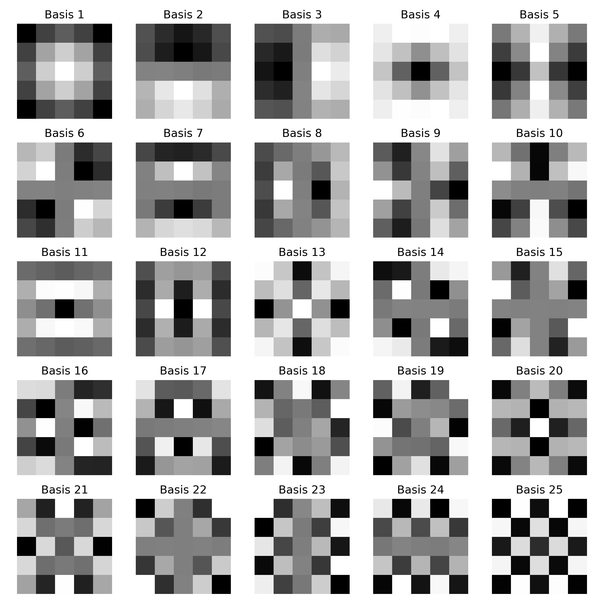
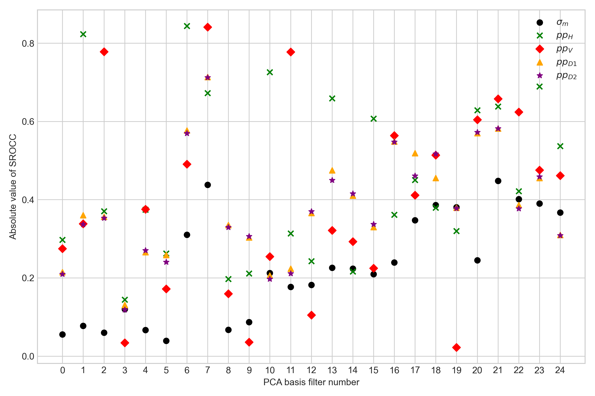

# Natural Scene Statistics Features

Re-implementation of the natural scene statistics-based feature descriptor for scale factor estimation.

This feature descriptor is proposed in [the paper](https://live.ece.utexas.edu/publications/2016/goodall2016blind.pdf):
*Goodall, T. R., Katsavounidis, I., Li, Z., Aaron, A., & Bovik, A. C. (2016). Blind picture upscaling ratio prediction. IEEE Signal Processing Letters, 23(12), 1801-1805.*

## Steps to reproduce Figures 2 and 4

1. Download BSD500 images

```bash
cd /tmp
wget http://www.eecs.berkeley.edu/Research/Projects/CS/vision/grouping/BSR/BSR_bsds500.tgz
tar zxvf BSR_bsds500.tgz
# Images will be located in "/tmp/BSR/BSDS500/data/images"
```

2. Compute basis functions

```bash
python compute_basis_functions.py \
  --image_root "/tmp/BSR/BSDS500/data/images" \
  --output "/tmp/basis_functions.npz"
```

3. Visualize correlation between upscaling factors and 125 features

```bash
python eval_features_upscaling_ratio.py \
  --image_root "/tmp/BSR/BSDS500/data/images" \
  --output_dir "/tmp" \
  --basis_functions_file "/tmp/basis_functions.npz"
```

## Results

Basis functions (compare to Fig. 2 in the paper)



Correlation between features and scale factors (compare to Fig. 4 in the paper)

